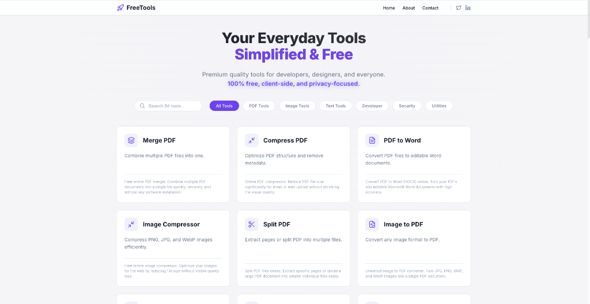
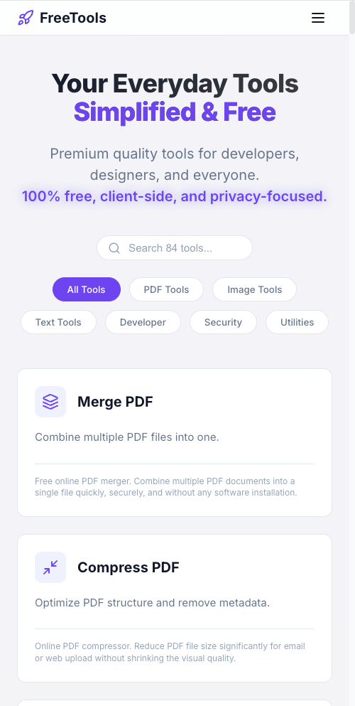

# 🚀 FreeTools (OnlineToolsVault)

  

  <h3 align="center">Premium Quality. 100% Free. Privacy Focused.</h3>

  

    A comprehensive suite of developer, PDF, and image tools running entirely in your browser.
     
    <a href="https://onlinetoolsvault.com"><strong>Visit onlinetoolsvault.com »</strong></a>
     
     
    <a href="https://github.com/OnlineToolsVault/OnlineToolsVault.github.io/issues">Report Bug</a>
    ·
    <a href="https://github.com/OnlineToolsVault/OnlineToolsVault.github.io/issues">Request Feature</a>
  

  

    
    
  

 

## ✨ Features

- **🛡️ 100% Client-Side:** No files are ever uploaded to a server. All processing happens in your browser via WebAssembly.
- **⚡ Blazing Fast:** Optimized for performance with instant load times.
- **🎨 Modern UI:** Clean, distraction-free interface designed for productivity.
- **📦 90+ Tools:** Everything from PDF manipulation to Image conversion and Developer utilities.

  

## 🛠️ Built With

- **React** - Frontend Library
- **Vite** - Build Tool
- **Tailwind CSS** - Styling
- **WebAssembly** - Heavy lifting for PDFs and Images

## 📜 License

**Source Code:** Proprietary. You may view the source code for educational purposes, but you may not copy, distribute, or modify it for commercial use or redistribution.

**Tools Usage:** Free to use for everyone, forever.

 

  Built with ❤️ by <a href="https://twitter.com/kuldeep_s_s">Kuldeep Singh Sidhu</a>

