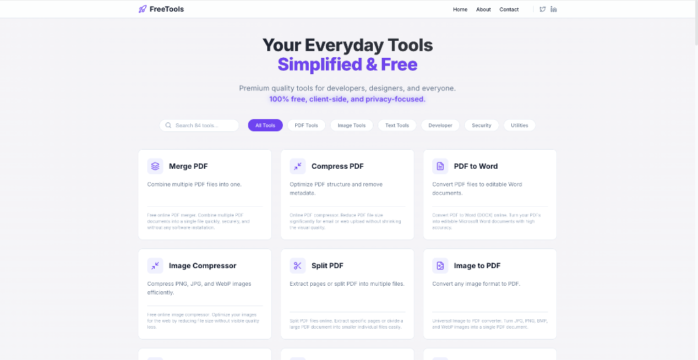

# 🚀 FreeTools (OnlineToolsVault)

<div align="center">
  <a href="https://onlinetoolsvault.com">
    
  </a>

  <h3 align="center">Premium Quality. 100% Free. Privacy Focused.</h3>

  <p align="center">
    A comprehensive suite of developer, PDF, and image tools running entirely in your browser.
    <br />
    <a href="https://onlinetoolsvault.com"><strong>Visit onlinetoolsvault.com »</strong></a>
    <br />
    <br />
    <a href="https://github.com/OnlineToolsVault/OnlineToolsVault.github.io/issues">Report Bug</a>
    ·
    <a href="https://github.com/OnlineToolsVault/OnlineToolsVault.github.io/issues">Request Feature</a>
  </p>

  <p align="center">
    <a href="https://x.com/sourcestrongai" target="_blank">
        
    </a>
    <a href="https://www.linkedin.com/company/sourcestrongai" target="_blank">
        
    </a>
  </p>
</div>

<br/>

A comprehensive collection of free, secure, and client-side online tools for PDF manipulation, image editing, and more. Built with React, Vite, and modern web technologies.

## 🚀 Features

**84 tools**, all running entirely in the browser — no uploads, no accounts, no server-side processing.
The catalogue in [`src/data/tools.js`](src/data/tools.js) is the single source of truth; routes,
the sitemap and the social preview images are all generated from it.

### 📄 PDF (23)
Merge · Split · Compress · Rotate · Flatten · Organize · Protect · Unlock · Add Watermark ·
Add Page Numbers · Edit · Metadata Editor · Remove Metadata · Extract Images · Thumbnails ·
PDF ⇄ Word · PDF → Excel · PDF → JPG / PNG / TXT · JPG → PDF

### 🖼️ Image (18)
Background Remover (AI) · Compressor · Converter · Resizer · Cropper · Blur · Add Watermark ·
Passport Photo Maker · Metadata Editor · Remove Metadata · Image → Text (OCR) · Image → PDF ·
HEIC → JPG · WebP → JPG · Merge Images · Bulk Compressor · Bulk Resizer ·
Instagram/Twitter Resizer · YouTube Thumbnail Downloader

### 🔧 Developer (11)
Code Formatter (multi-language) · HTML · CSS · JS · JSON · SQL · XML formatters ·
Cron Parser · Regex Tester · Color Picker

### 🔐 Security (13)
Hash Generator · Encrypt / Decrypt Text · Bcrypt · UUID · Base64 encode/decode ·
URL encode/decode · JWT Decoder · Password Strength · File Checksum · File Encryption

### 📝 Text (6)
Word Counter · Humanize AI Text · Paste to Markdown · Markdown Previewer ·
Lorem Ipsum Generator · Diff Viewer

### 🧰 Converters & Utilities (13)
QR Generator · CSV ⇄ JSON · CSV ⇄ Excel · Timestamp Converter · Unit Converter ·
ZIP Creator / Viewer · File Size Calculator · Batch File Renamer · File Metadata Viewer ·
Video → Audio · Audio Converter

<div align="center">
  
</div>

## 🛠️ Tech Stack

- **Framework**: React + Vite
- **Styling**: Vanilla CSS (CSS Variables, Responsive Design)
- **Routing**: React Router DOM (v6)
- **SEO**: React Helmet Async
- **Icons**: Lucide React
- **Core Libraries**:
  - `pdfjs-dist` & `pdf-lib` (PDF processing)
  - `browser-image-compression` (Image optimization)
  - `@imgly/background-removal` (AI Background removal)

## ⚠️ Usage Limitations

> [!IMPORTANT]
> The source code is provided for **educational and evaluation purposes only** under the Proprietary License. You may run this project locally to review its functionality, but you are **strictly prohibited** from modifying, distributing, or deploying it for public or commercial use without explicit permission.

## 🏃‍♂️ Running Locally

### Prerequisites
- Node.js (v18 or higher recommended)
- npm

### Installation

1. **Clone the repository**
   ```bash
   git clone https://github.com/OnlineToolsVault/OnlineToolsVault.github.io.git
   cd OnlineToolsVault.github.io
   ```

2. **Install dependencies**
   ```bash
   npm install
   ```

### Development Mode
To start the development server with hot reload:
```bash
npm run dev
```
Open [http://localhost:5173](http://localhost:5173) in your browser.

### Production Preview
To build the project and preview the production build locally:
```bash
npm run build
npm run preview
```
Open [http://localhost:4173](http://localhost:4173) in your browser.

## 🚀 Deployment

The project is already configured for automated deployment to **GitHub Pages** using GitHub Actions.

### Steps to Deploy:
1. **Repository Settings**: In your GitHub repository, go to **Settings > Pages**.
2. **Build and Deployment**: Set **Source** to "GitHub Actions".
3. **Trigger Deployment**: Any push to the `main` branch will trigger the workflow defined in `.github/workflows/deploy.yml`.
4. **Automated Steps**: The workflow will:
   - Install dependencies.
   - Generate the SEO Sitemap.
   - Build the production assets with the correct base path (`/`).
   - Deploy the contents of the `dist` folder to the `gh-pages` branch.

## 📄 License

This project is released under a **Proprietary License** — see [`LICENSE`](LICENSE) for the full terms.
It is **not** open source: the source is published for evaluation only, as described under
[Usage Limitations](#️-usage-limitations) above.

For the full license terms, please visit: [License Terms](https://github.com/OnlineToolsVault/OnlineToolsVault.github.io?tab=License-1-ov-file)

- 💻 [Project Repository](https://github.com/OnlineToolsVault/OnlineToolsVault.github.io)

---

## 🏗️ Architecture & Deployment

This project uses a **Multi-Entry SPA** architecture to ensure perfect compatibility with GitHub Pages, Google AdSense, and SEO crawlers.

### The Problem it Solves
GitHub Pages is a static host. By default, visiting a deep link like `/word-counter` returns a **404 Not Found** because that physical file doesn't exist. This breaks AdSense (which requires HTTP 200 OK) and hurts SEO.

### The Solution: Multi-Entry SPA
During the build process (`npm run build`), we programmatically generate physical directories and `index.html` files for every route:

```text
dist/
├── index.html              (Root entry point)
├── .nojekyll              (Prevents Jekyll processing)
├── 404.html               (Smart fallback for typos)
├── word-counter/
│   └── index.html         (Copy of main index.html)
└── ...
```

When a user requests `/word-counter`, GitHub Pages redirects to `/word-counter/` and serves the physical
file at `dist/word-counter/index.html` with **HTTP 200 OK**. Because the trailing-slash form is the one
that actually returns 200, it is what `sitemap.xml`, every `<link rel="canonical">` and `og:url` point at.

Each of those per-route files also carries its own `<title>`, description and Open Graph image, so
crawlers and social-media unfurlers — which do not execute JavaScript — see real per-tool metadata.
The three tags React also manages are emitted with `data-rh="true"` so react-helmet-async replaces
them on hydration instead of appending a conflicting second copy.

### 🛠️ Automated Workflow

We have automated the entire process to prevent errors:

1.  **`npm run validate-routes`**: Checks that every route defined in `src/App.jsx` matches the routes in `generate-sitemap.js`. Runs automatically before build.
2.  **`node generate-sitemap.js`**:
    *   Generates `sitemap.xml`.
    *   Creates the physical folder structure in `dist/`.
    *   Creates `.nojekyll` and `404.html`.
3.  **Use `npm run prepare-deploy`**: Runs the full sequence: Validate → Build → Generate.

### ➕ Adding a New Tool

1.  Add the tool to `src/data/tools.js` (id, name, description, seoDescription, path, icon, category).
2.  Add the route in `src/App.jsx`.
3.  Add the route to the `routes` array in `generate-sitemap.js`.
4.  Run `npm run validate-routes` to verify, then `npm run generate-og` to render its preview image.

---

<div align="center">
  <sub>Built with ❤️ by <a href="https://x.com/sourcestrongai">Source Strong AI</a></sub>
</div>